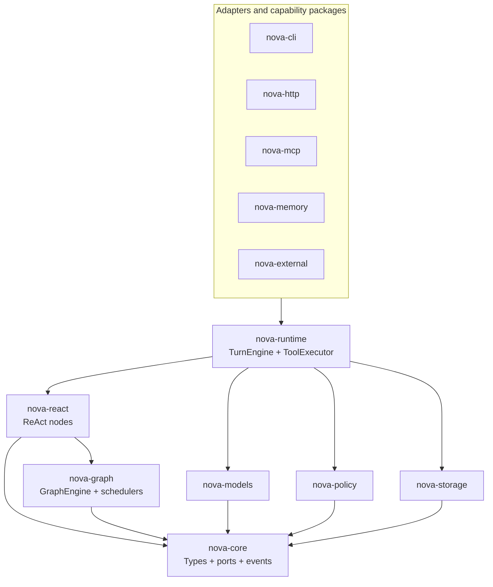

# Phase 0 architecture baseline

NovaAgent uses ports and adapters around a graph execution kernel. The graph
runtime owns admission, invocation lifecycle, deliver records, control safety
points and quiescence. ReAct is a graph strategy, not a second execution loop.

## Boundary rules

1. `nova-core` contains only frozen wire models, errors and abstract ports. It
   performs no network or database I/O and imports no package above it.
2. `nova-graph` depends on the standard library and Core contracts only.
3. Runtime resources (HTTP clients, database connections, processes and locks)
   are injected through context/adapters, never placed in serializable models.
4. Tool calls have one choke point (`ToolExecutor`) before any side effect;
   policy and approval are not adapter responsibilities.
5. EventSink is the real-time observation surface. Reliable node inputs use the
   DeliverStore and are never encoded as scheduler wakeup payloads.
6. Every Turn has one terminal event and reaches completion only after graph
   quiescence. Fresh, approval recovery and crash recovery share one scheduler.

The package dependency direction and these rules are architectural contracts;
the Phase 0 quality check and later AST tests must reject violations.

